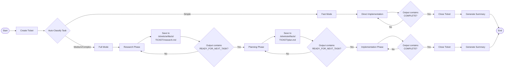

## Ralph Loop and Frequent Intentional Context Compaction

_February 2026_

There's been a few things I've been playing around and thinking about,
specifically around how one might 'implement' the ideas.

- Beads
- Ralph Wiggum Loop
- Context Compaction and Management

To that end, I have a single
[Python script example](https://github.com/NoRaincheck/basic-ralph/blob/main/basic_ralph.py).

This aims to address a few items:

- Manage cross tasks through the use of 'tickets' (similar to beads), but in a
  more prescriptive way, where the tickets are created and actively closed
  outside of the agent loop (n.b. the agent can also create tickets, this way is
  more intentional which I've found works better for a 'human' reviewer, cause
  then the determinism guarentees that the ticket is seen and reviewable.
- The Ralph Wiggum loop manages the completion by assessing the ticket queue and
  seeing whether or not it is complete or not
- As part of injecting context to the Ralph Wiggum loop (since context is not
  preserved), we make use of Context Compaction workflow which is the 'Research,
  Plan, Implement' steps, whereby explicit guidance for researching, then
  planning is made to populate the context before finally implementing

In general this loop works well, particularly for more complex tasks. The Ralph
loop guarentees that it will at least see the task to completion.

### Other Practical Thoughts

**Explicitly Reviewing Outputs**

By explicitly outputting the artifacts so that it can be reviewed post-hoc was
invaluable. Seeing the 'research' plan (i.e. looks through the project files to
understand where things are at) before 'planning' (i.e. coming up with a task
list to build), meant that sources of issues could be discovered and rectified
at the appropriate step. Linking these artifacts to a particular ticket was also
helpful in matching tickets created (the initial goal) with the context and plan
that was created before implementation.

**Enabling a Fast Mode**

Sometimes tasks are not complicated. In that scenario, a 'research' and
'implement' flow was sufficient as there was minimal value created from the
additional planning. This shortcut made things a lot quicker with minimal impact
to the final outcome.

**Next Steps and Extensions**

The trial for this was rather limited, using only `opencode` and ignoring
'SKILLS'. It also had the makings of a simplified 'Gas Town' setup where there
was one primary agent starting with the initial ticket and optional agents
downstream. By explicitly encoding the steps (the steps are in _code_ not from
the LLM), meant that there were implicitly sub-agent pattern which came from it.

